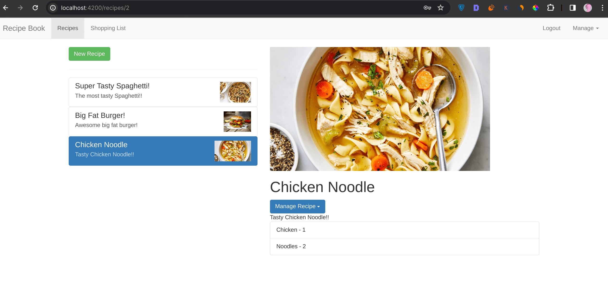

# Recipe Book - An app to store your recipes.

## Welcome! 👋
This is a project I built while taking Maximilian Schwarzmüller's Angular course on Udemy. During this course project, I worked on major ng concepts like Components, Databinding, Directives, Services & dependency injection, Routing, Observables, Forms, Pipes, Making Http requests, Authentication & Route protection, splitting Angular app into modules for optimization, and much more!

## How To Run? 🤔
Download this code either as a `zip file` or use the `git clone` command to clone it.
Then, open the project folder in your editor and on the integrated terminal:
-  Run `npm install` to install all the packages used for this project.
After the installation,
- Run `ng serve` to run the project on your browser localhost.
    That's all you'd need to do 🙂

## Want To Contribute? 
Feel free to open a pull request on this repository is there's any feature you'd like to add to this app!

## Have A Feedback? 
Giving feedback is appreciated, if you any to give on this project please let me know at beatriceebirim@gmail.com.

**Happy Coding 💪**
